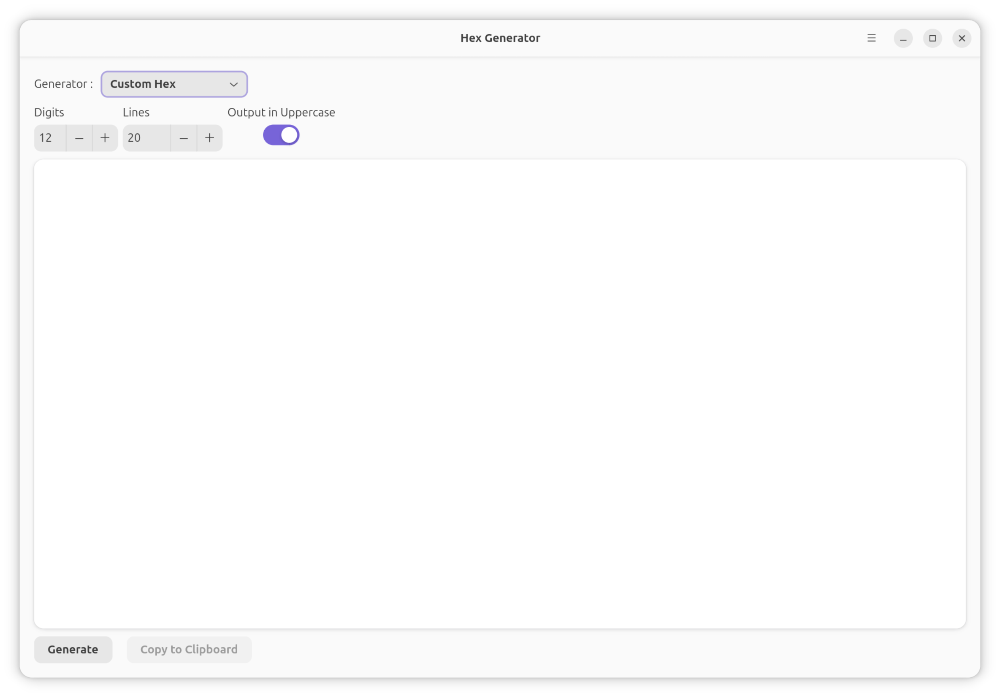
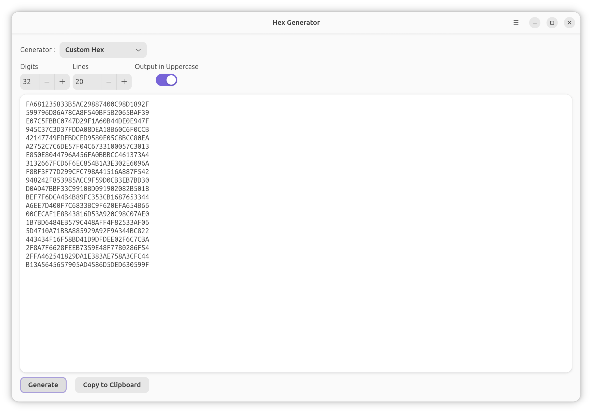
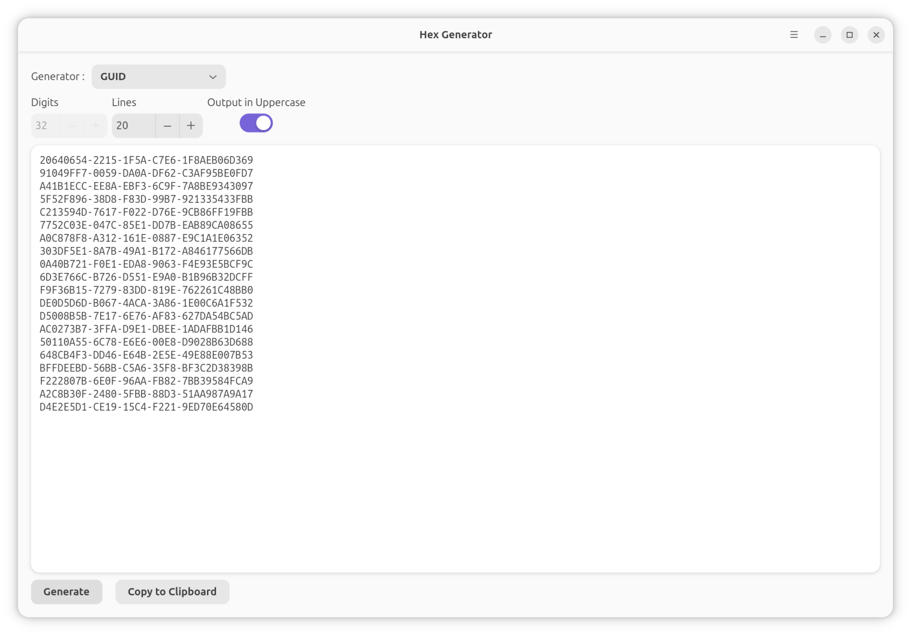

# HEX Generator

A simple yet versatile HEX Generator application built with Rust and GTK+ 4 for Linux desktops.

## Features

*   **Theme Support:** Adapts to your system's light or dark theme settings for a native look and feel.
*   **Variety of Generators:** Provides several types of data generation:
    *   **Custom:** Generate HEX strings with a user-defined number of digits.
    *   **GUID:** Generate universally unique identifiers (UUID v4).
    *   **Mac Address:** Generate random MAC addresses.
    *   **HEX Color:** Generate random HEX color codes (e.g., #RRGGBB).
    *   **HEX Color with alpha:** Generate random HEX color codes with an alpha channel (e.g., #AARRGGBB).
    *   **Byte Sequence:** Generate sequences of HEX bytes (e.g., 00 FF 1A).
    *   **Prefixed HEX:** Generate HEX strings with a "0x" prefix.
*   **Customizable Output:** Control the number of lines and digits (for applicable generators) and toggle uppercase output.
*   **Easy Sharing & Saving:** Copy generated data to the clipboard, share it, or save it to a file.

This project is open source and aims to provide a straightforward tool for developers and users who need to quickly generate various HEX-based data.

## Command Line Interface

The application can also be used from the command line for automation and scripting purposes. When no arguments are provided, the GUI will launch.

### Usage

```bash
xrayhexgenerator [OPTIONS]
```

### Options

- `-g, --generator <TYPE>` - Generator type (required for CLI mode)
  - Available types: `custom`, `mac`, `guid`, `hexcolor`, `hexalpha`, `byteseq`, `prefixed`
- `-l, --lines <X>` - Number of lines to generate (default: 1)
- `-d, --digits <Y>` - Number of digits (where applicable)
- `-u, --uppercase` - Use uppercase hexadecimal characters
- `-h, --help` - Print help information
- `-V, --version` - Print version information

### Examples

Generate 5 custom hex values with 16 digits each:
```bash
xrayhexgenerator -g=custom -l=5 -d=16
```

Generate 3 MAC addresses in uppercase:
```bash
xrayhexgenerator -g=mac -l=3 -u
```

Generate 10 GUIDs:
```bash
xrayhexgenerator -g=guid -l=10
```

Generate 5 hex colors:
```bash
xrayhexgenerator -g=hexcolor -l=5
```

Generate byte sequences with 12 digits:
```bash
xrayhexgenerator -g=byteseq -l=4 -d=12
```

Generate prefixed hex values in uppercase:
```bash
xrayhexgenerator -g=prefixed -l=3 -d=8 -u
```


## Screenshots

<a href="screenshots/screenshot01.png"></a>
<a href="screenshots/screenshot02.png"></a>
<a href="screenshots/screenshot03.png"></a>


## Installation sources
### From Snap Store

[](https://snapcraft.io/xrayhexgenerator)

### As .dep package

1. Download the latest `.deb` package from the project's GitHub releases page.
2. Open a terminal and navigate to the directory where you downloaded the file.
3. Install the package using the following command:

   ```bash
   sudo apt install [name-of-the-package].deb
   ```

### As .rpm package

1. Download the latest `.rpm` package from the project's GitHub releases page.
2. Open a terminal and navigate to the directory where you downloaded the file.
3. Install the package using the following command:

    ```bash
    sudo dnf install [name-of-the-package].rpm
    # or, for openSUSE:
    sudo zypper install [name-of-the-package].rpm
    # or, for older systems:
    sudo rpm -i [name-of-the-package].rpm
    ```

Replace `[name-of-the-package].rpm` with the actual file name.

